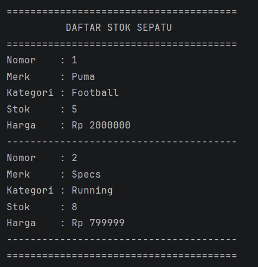
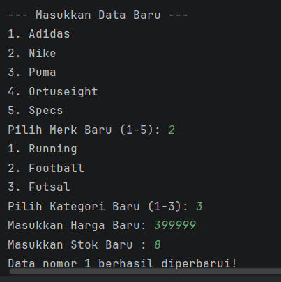

# Laporan Posttest 2 - Sistem Penjualan Sepatu Olahraga

### **Nama: M.TEDY AZHARI**
### **NIM: 2409106003**
### **Kelas: A1'24**

---

## Deskripsi Program
### **Ini tuh program apa sihh?**
Jadi, program ini tuh gunanya buat ngatur stok sepatu olahraga.
Kita bisa nambahin data sepatu baru, ngeliat daftar sepatu yang udah ada,
trus bisa ngedit (kalo ada typo atau harga naik),
dan bisa ngehapus data kalo sepatunya udah laku terjual.
Semuanya disimpen pake **ArrayList**, jadi datanya dinamis banget!

---

## Fitur Utama
1. **Tambah Stok Sepatu**: Memasukkan data sepatu baru dengan sistem pilihan merk (1-5) dan kategori (1-3).
2. **Lihat Semua Sepatu**: Menampilkan seluruh daftar sepatu yang tersedia beserta detail harga, stok, dan kategorinya.
3. **Ubah Data Sepatu**: Memperbarui informasi merk, kategori, harga, dan stok sepatu pada daftar yang sudah ada berdasarkan nomor urut.
4. **Hapus Sepatu**: Menghapus data sepatu secara permanen dari daftar stok dengan menginput nomor pada tabel stok sepatu.
---

## Berikut Screenshot fitur-fitur yang ada

### 🏠 **MENU UTAMA**
Ini adalah tampilan awal buat milih fitur-fitur yang ada di program:

  

### ➕ **MENU TAMBAH DATA**
Tampilan pas kita lagi asik nambahin data sepatu:

  
    
  

### 📋 **MENU TAMPILKAN DATA**
Nampilin semua stok sepatu:

  

### ✏️ **MENU EDIT DATA**
Kalo ada salah input, tinggal sat-set diedit lewat sini:

  
    
  

### 🗑️ **MENU DELETE DATA**
Kalo udh ga butuh, data yang lama hapus aja:

  

### ⚠️ **INPUT NEGATIF (VALIDASI SETTER)**
Tampilan kalo input harga negatif, 
program bakal nolak dan minta input ulang:

  

---
*Laporan POSTTEST 2 Pemrograman Berorientasi Objek.*