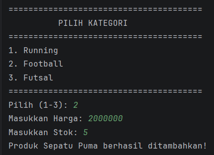
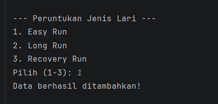
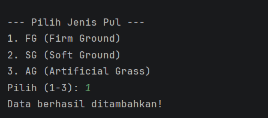
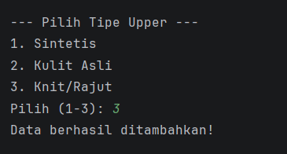
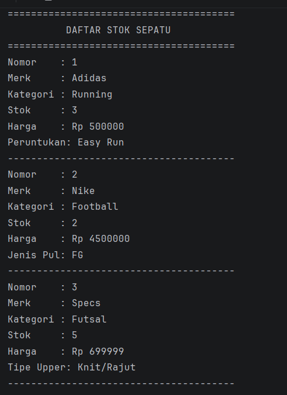
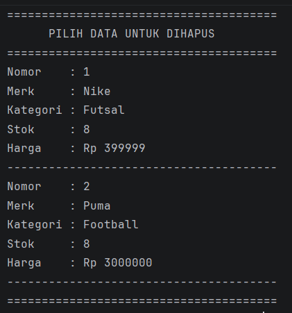
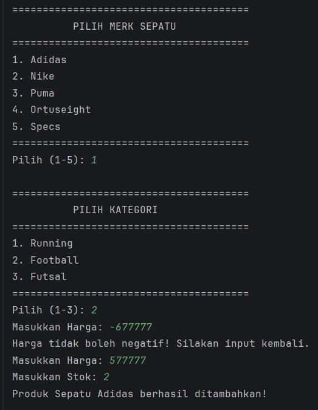

# Laporan Posttest 3 - Sistem Penjualan Sepatu Olahraga 

### **Nama: M.TEDY AZHARI**
### **NIM: 2409106003**
### **Kelas: A1'24**

---

## Deskripsi Program
### **Ini tuh program apa sihh?**
Jadi, program ini tuh gunanya buat ngatur stok sepatu olahraga.
Kita bisa nambahin data sepatu baru, ngeliat daftar sepatu yang udah ada,
trus bisa ngedit (kalo ada typo atau harga naik),
dan bisa ngehapus data kalo sepatunya udah laku terjual.
Semuanya disimpen pake **ArrayList**, jadi datanya dinamis banget!

---

## Fitur Utama
1. **Tambah Stok Sepatu**: Memasukkan data sepatu baru dengan sistem pilihan merk (1-5) dan kategori (1-3).
2. **Lihat Semua Sepatu**: Menampilkan seluruh daftar sepatu yang tersedia beserta detail harga, stok, dan kategorinya.
3. **Ubah Data Sepatu (Full Update)**: Memperbarui informasi secara total mulai dari merk, harga, stok, hingga atribut spesifik tiap jenis sepatu.
4. **Hapus Sepatu**: Menghapus data sepatu secara permanen dari daftar stok dengan menginput nomor pada tabel stok sepatu.

---

## 🆕 Inheritance
Penerapan **Superclass** `Sepatu` yang diturunkan ke 3 **Subclass** spesifik:
* **SepatuLari**: Memiliki atribut unik `peruntukanLari` (Easy Run, Long Run, Recovery Run).
* **SepatuBola**: Memiliki atribut unik `jenisPul` (FG, SG, AG).
* **SepatuFutsal**: Memiliki atribut unik `tipeUpper` (Sintetis, Kulit Asli, Knit).

---

## Fitur Baru
1. **Method Overriding**: Modifikasi method `tampilkan()` pada tiap subclass untuk menampilkan atribut unik.
2. **Polimorfisme**: Penyimpanan berbagai jenis objek subclass dalam satu `ArrayList<Sepatu>`.
3. **Update Dinamis**: Penggunaan `instanceof` untuk mengubah atribut spesifik sesuai tipe objek.
4. **Menu Pilihan Angka**: Input spesifik (1-3) untuk menjaga konsistensi data.

---

## Berikut Screenshot fitur-fitur yang ada

### 🏠 **MENU UTAMA**

  

### ➕ **MENU TAMBAH DATA**

  
    
  
    
  
    
  
    
  

### 📋 **MENU TAMPILKAN DATA**

  

### ✏️ **MENU EDIT DATA**

  
    
  

### 🗑️ **MENU DELETE DATA**

  

### ⚠️ **INPUT NEGATIF (VALIDASI SETTER)**

  

---
*Laporan POSTTEST 3 Pemrograman Berorientasi Objek - Universitas Mulawarman.*